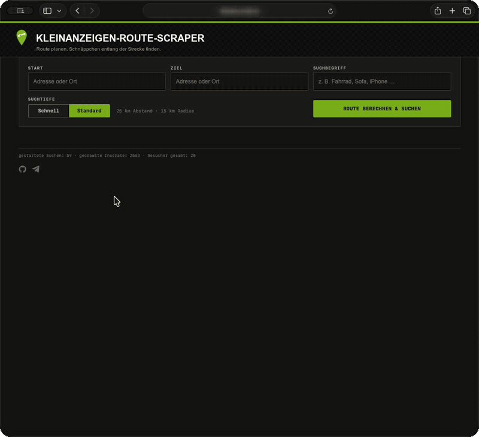

# kleinanzeigen-route-scraper

`kleinanzeigen-route-scraper` sucht Kleinanzeigen entlang einer berechneten Fahrtroute und zeigt die Treffer auf einer interaktiven Karte. Die Anwendung setzt in festen Abständen Suchpunkte direkt auf die Route, löst diese in Postleitzahlen auf und führt für jeden eindeutigen Suchort eine eigene, radiusbegrenzte Kleinanzeigen-Suche aus.

> [!IMPORTANT]
> Dieses inoffizielle Open-Source-Projekt steht in keiner Verbindung zu Kleinanzeigen und wird von Kleinanzeigen weder angeboten noch unterstützt. Der Name „Kleinanzeigen“ dient ausschließlich der Beschreibung der technischen Kompatibilität.
>
> Das Repository erteilt keine Erlaubnis zum automatisierten Zugriff auf Dienste oder Inhalte Dritter. Wer die Software betreibt, ist selbst dafür verantwortlich, vorab erforderliche Zustimmungen einzuholen und die jeweils geltenden Nutzungsbedingungen sowie gesetzlichen Vorgaben einzuhalten.

## Demo



## Funktionen

- Routenberechnung via OpenRouteService (ORS)
- Adress-Autocomplete via ORS Geocoding + Nominatim-Fallback
- Zwei Suchtiefen: **Schnell** (50 km Abstand, 10 km Radius) und **Standard** (25 km Abstand, 15 km Radius)
- Unabhängige Kleinanzeigen-Suche für jede eindeutige PLZ entlang der Route
- Tatsächliche Standortangaben und privacy-gerundete Koordinaten der Inserate
- Sichtbare Suchpunkte und Ergebnisse auf der Karte
- Klick auf einen Inserat-Pin filtert die Ergebnisliste, klappt die betroffenen Gruppen auf und springt direkt zu den Treffern
- Gruppierung nach Ort oder Kategorie sowie Preisfilter und Sortierung
- Responsives Webfrontend, kein Build-Schritt nötig

## Funktionsweise

1. Start und Ziel werden über OpenRouteService ausgewählt und als eindeutige Koordinaten an das Backend übertragen.
2. ORS berechnet die Fahrtroute.
3. Das Backend setzt entsprechend der gewählten Suchtiefe Punkte entlang der vollständigen Routenlinie.
4. Jeder Punkt wird per ORS-Reverse-Geocoding, bei Bedarf über einen gedrosselten Nominatim-Fallback, einer PLZ zugeordnet.
5. Für jede eindeutige PLZ wird eine getrennte Kleinanzeigen-Suche ausgeführt. Standort-Cookies werden zwischen den Suchorten gelöscht, damit nicht der erste Ort alle weiteren Suchen überschreibt.
6. Treffer außerhalb des eingestellten Radius werden verworfen und doppelte Inserate zusammengeführt.

## Voraussetzungen

- Docker und Docker Compose
- OpenRouteService API-Key: [openrouteservice.org](https://openrouteservice.org)

## Quickstart

```bash
cp .env.example .env
# ORS_API_KEY in .env eintragen
docker compose up -d
```

Frontend läuft dann unter [http://localhost:8401](http://localhost:8401).

## Umgebungsvariablen

| Variable | Standard | Beschreibung |
|---|---|---|
| `ORS_API_KEY` | — | OpenRouteService API-Key (Pflicht) |
| `MAINTENANCE_MODE` | `0` | App sperren, Zugang nur mit Key |
| `MAINTENANCE_KEY` | — | Passwort für Wartungsmodus |
| `STATS_HASH_SALT` | — | Zufälliger Salt für nicht rückrechenbare Besucher-Hashes |
| `SCRAPER_RATE_LIMIT_SECONDS` | `1.0` | Mindestabstand zwischen Kleinanzeigen-Aufrufen |
| `NOMINATIM_RATE_LIMIT_SECONDS` | `1.1` | Mindestabstand für PLZ-Fallbacks ungelöster Routenpunkte |
| `PROXY_ALLOW_HOSTS` | Nominatim, Kleinanzeigen | Exakte Host-Allowlist für den eingeschränkten Proxy |

Der ORS-Key und der Wartungsschlüssel bleiben serverseitig und werden nicht an den Browser ausgeliefert. Im Produktivbetrieb sollte `STATS_HASH_SALT` auf einen langen, zufälligen Wert gesetzt werden.

## Sicherheit

- Reale Zugangsdaten gehören ausschließlich in die lokale `.env`; `.env`, Schlüsseldateien und `data/` werden von Git ignoriert.
- Der ORS-Key wird nur vom Backend gelesen. Der ORS-Proxy erlaubt ausschließlich die für Route und Geocoding benötigten Endpunkte.
- Der allgemeine Proxy akzeptiert nur exakt konfigurierte Hosts, nur Standardports und keine privaten oder lokalen Zieladressen. Weiterleitungen werden erneut geprüft und Antworten sind größenbegrenzt.
- Fremde Proxy-Inhalte werden immer als nicht ausführbarer Text mit `nosniff` und restriktiver CSP ausgeliefert.
- Nginx setzt Sicherheitsheader, blockiert Cross-Origin-Zugriffe und begrenzt Anfragen sowie parallele Verbindungen pro IP.
- Der Wartungsmodus verwendet einen serverseitigen Schlüssel und konstantzeitlichen Vergleich. Nutze dafür ein langes, zufälliges Passwort.

Vor jedem öffentlichen Deployment empfiehlt sich zusätzlich:

```bash
pip-audit -r api/requirements.txt
```

## Grenzen und Rücksicht auf Upstreams

- Kleinanzeigen stellt keine offizielle öffentliche Such-API für diesen Anwendungsfall bereit. Änderungen am HTML können den Parser beeinträchtigen.
- Die Software ist nicht dazu bestimmt, CAPTCHAs, IP-Sperren, Authentifizierung oder andere technische Zugriffsbeschränkungen zu umgehen. Entsprechende Umgehungsfunktionen werden nicht akzeptiert.
- Eine Drosselung technischer Anfragen ersetzt keine gegebenenfalls erforderliche Zustimmung des jeweiligen Dienstanbieters.
- ORS, Nominatim und Kleinanzeigen haben Nutzungslimits. Die Anwendung serialisiert und drosselt Upstream-Aufrufe deshalb bewusst.
- Inserat-Koordinaten sind aus Datenschutzgründen häufig gerundet und entsprechen nicht zwingend einer Hausadresse.
- Kann ein Routenpunkt keiner PLZ zugeordnet werden, kennzeichnet die Oberfläche die Suche als teilweise abgeschlossen.
- Das Projekt ist für private Tests und Self-Hosting gedacht. Bitte beachte die Nutzungsbedingungen der angebundenen Dienste.

## Manueller Parser-Test

Die Kleinanzeigen-Anbindung ist ein eigener HTTP-Parser in `api/scraper_http.py` und keine Laufzeitabhängigkeit von einem externen Crawler-Projekt. Weil Kleinanzeigen seine HTML-Struktur jederzeit ändern kann, existiert ein bewusst ausschließlich manuell startbarer Live-Test mit genau einer Suchergebnisseite.

Der Test prüft, ob weiterhin Inserate sowie Titel, URLs, Preise und Standorte extrahiert werden. Er läuft nicht zeitgesteuert oder automatisch. Ein Betreiber kann ihn unter *Actions → Parser live monitor* bewusst manuell starten; bei einem Fehler wird ein GitHub-Issue mit dem Titel **Parser-Monitor fehlgeschlagen** geöffnet und nach einem späteren erfolgreichen manuellen Lauf wieder geschlossen.

## Updates

Das Docker-Image wird bei jedem Push auf `main` automatisch gebaut und als `ghcr.io/92thms/kleinanzeigen-route-scraper:latest` veröffentlicht. Auf dem Server reicht dann:

```bash
git pull --ff-only origin main
docker compose pull
docker compose up -d --force-recreate
```

Damit das funktioniert, muss das Paket auf GitHub unter *Packages → kleinanzeigen-route-scraper → Package settings* auf **Public** gestellt sein — oder man loggt sich mit `docker login ghcr.io` am Server ein.

## Projektstruktur

```
api/          FastAPI-Backend (Python)
web/          Statisches Frontend (HTML/CSS/JS)
ops/          Dockerfile + Nginx-Konfiguration
tests/        Pytest-Tests
```

## Entwicklung

Backend und Frontend lassen sich unabhängig voneinander bearbeiten. Das Backend (`api/main.py`) startet mit Uvicorn, das Frontend ist statisch und braucht keinen Build. Prüfungen:

```bash
python -m venv .venv
. .venv/bin/activate
pip install -r api/requirements.txt pytest ruff
pytest -q
ruff check api tests
node --check web/route.js
```

Die Kleinanzeigen-Suche wird direkt durch den kleinen HTTP-Parser in `api/scraper_http.py` umgesetzt. Für Parser-Änderungen existieren lokale HTML-Tests sowie ein ausschließlich manuell startbarer Live-Test.

## Lizenz

[MIT](LICENSE)
